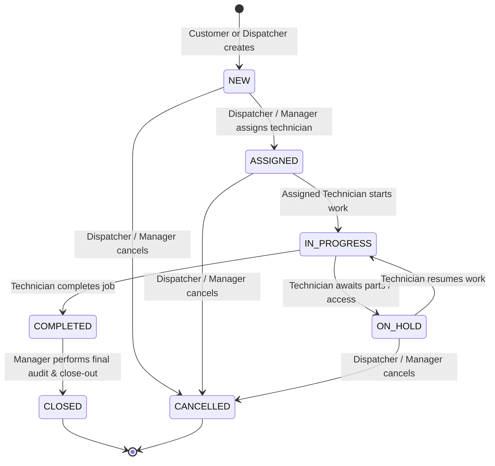

# 🏢 Project KEYSTONE — Enterprise Field Service & Work Order Management Platform

[](https://www.oracle.com/java/)
[](https://spring.io/projects/spring-boot)
[](https://react.dev/)
[](https://www.postgresql.org/)
[](https://flywaydb.org/)
[](http://localhost:8080/swagger-ui.html)
[]()

> **Zidio Development 4-Week Capstone Engineering Project**  
> Built for **Meridian Facilities Management** to replace paper-based work orders with a high-throughput, governed, real-time Field Service Management (FSM) platform.

---

## 📋 Table of Contents
1. [Platform Architecture](#-platform-architecture)
2. [Role-Based Access Control (RBAC) & Seed Credentials](#-role-based-access-control-rbac--seed-credentials)
3. [Governed State Machine & Workflow Rules](#-governed-state-machine--workflow-rules)
4. [SLA Monitoring Engine & Financial Tracking](#-sla-monitoring-engine--financial-tracking)
5. [Quickstart: Clean-Checkout Setup](#-quickstart-clean-checkout-setup)
6. [Interactive OpenAPI / Swagger Documentation](#-interactive-openapi--swagger-documentation)
7. [Automated Test Suite & Verification](#-automated-test-suite--verification)
8. [Module & Milestone Roadmap](#-module--milestone-roadmap)

---

## 🏛 Platform Architecture

```
                                  +---------------------------------------+
                                  |         Client Web Browser           |
                                  +-------------------+-------------------+
                                                      |
                                                      v
                                  +-------------------+-------------------+
                                  |       Nginx Reverse Proxy / SPA       |
                                  |     (Port 80 / 3000 / React 19)       |
                                  +---------+-------------------+---------+
                                            |                   |
                        [Static Assets & UI]|                   |[REST API / JWT]
                                            v                   v
                               +------------+--+     +----------+------------+
                               | React 19 +   |     | Spring Boot 3 Backend |
                               | Tailwind CSS |     | (Java 21, Port 8080)  |
                               +---------------+     +-----------+-----------+
                                                                 |
                                              [JPA / Hibernate / Flyway]
                                                                 v
                                                     +-----------+-----------+
                                                     | PostgreSQL 16 DB      |
                                                     | (Port 5432)           |
                                                     +-----------------------+
```

### Technology Stack
- **Backend**: Spring Boot 3 (Java 21), Spring Data JPA, Spring Security (Stateless JWT via JJWT 0.12.6), Flyway Database Migrations (V1 to V14), Springdoc OpenAPI 3.0.
- **Frontend**: React 19 SPA, Vite 8, Tailwind CSS, Lucide Icons, Glassmorphic & Modern Dark-Mode Ready Styling.
- **Database**: PostgreSQL 16 with indexed relational constraints and append-only audit trail tables.
- **Containerization**: Multi-stage Docker builds and Docker Compose orchestration.

---

## 🔐 Role-Based Access Control (RBAC) & Seed Credentials

The platform enforces strict role boundaries across 4 core organizational personas:

| Role | Seed Email | Password | Permissions & Views |
| :--- | :--- | :--- | :--- |
| **Manager** | `manager@keystone.com` | `password` | Executive KPI dashboard, SLA compliance reports, final work order close-out signoff, customer & site management. |
| **Dispatcher** | `dispatcher@keystone.com` | `password` | Work order intake & dispatching, 7-column Kanban board, technician assignment, customer & site management, cancellation. |
| **Technician** | `technician@keystone.com` | `password` | Field mobile view, self-assigned job progression (`IN_PROGRESS`, `ON_HOLD`, `COMPLETED`), transactional parts inventory consumption, labor time logging. |
| **Customer** | `customer@keystone.com` | `password` | Customer Self-Service Portal (`/portal`), urgent maintenance ticket creation, real-time live ticket tracking. |

---

## ⚙️ Governed State Machine & Workflow Rules

Work orders strictly adhere to a deterministic state machine. Bypassing steps (e.g. `NEW` to `COMPLETED`) is prohibited and rejected with `409 Conflict` / `IllegalStateException`.



### Key Enforcements:
- **Append-Only Audit Trail**: Every single transition automatically records an entry in `work_order_status_history` with the timestamp, user ID, previous status, next status, and optional notes.
- **Strict Close-Out**: Only users with the `MANAGER` role can transition a work order from `COMPLETED` to `CLOSED`.
- **Technician Ownership**: Only the assigned technician (or a manager override) can start, hold, or complete a work order.

---

## ⏱ SLA Monitoring Engine & Financial Tracking

1. **Automated Priority-Based SLAs**:
   - `CRITICAL`: 2 Hours
   - `HIGH`: 4 Hours
   - `MEDIUM`: 8 Hours
   - `LOW`: 24 Hours
2. **Background SLA Breach Detection**:
   - `SlaMonitoringService` runs background tasks to detect breached SLAs and mark work orders for immediate dispatcher triage.
3. **Transactional Parts Consumption**:
   - Stock quantities decrement atomically in a `@Transactional` boundary.
   - Non-negative stock invariant strictly prevents over-consumption.
4. **Labor Cost Aggregation**:
   - Labor minutes logged per technician multiplied by hourly rates and added to parts unit costs for live profitability analytics.

---

## 🚀 Quickstart: Clean-Checkout Setup

### Option 1: One-Command Docker Compose (Recommended)

Make sure Docker and Docker Compose are installed:

```bash
git clone <repo-url>
cd KEYSTONE
docker-compose up --build
```

- **Frontend App**: `http://localhost:3000` (or `http://localhost`)
- **Backend API**: `http://localhost:8080`
- **Swagger UI**: `http://localhost:8080/swagger-ui.html`
- **PostgreSQL**: `localhost:5432` (db: `keystone`, user: `postgres`, pass: `password`)

---

### Option 2: Local Development Setup

#### 1. PostgreSQL Database
Ensure a PostgreSQL server is running locally on port 5432 with database `keystone`.

#### 2. Backend (Spring Boot)
```bash
cd KEYSTONE
./mvnw clean spring-boot:run
```
*Flyway will automatically execute migrations `V1` through `V14` and seed default users, customers, sites, and parts.*

#### 3. Frontend (React + Vite)
```bash
cd frontend
npm install
npm run dev
```
*Access the frontend at `http://localhost:5173`.*

---

## 📖 Interactive OpenAPI / Swagger Documentation

Project KEYSTONE includes integrated OpenAPI 3.0 documentation.

- **Swagger UI URL**: [http://localhost:8080/swagger-ui.html](http://localhost:8080/swagger-ui.html)
- **OpenAPI JSON Spec**: [http://localhost:8080/v3/api-docs](http://localhost:8080/v3/api-docs)

To test secured endpoints directly in Swagger UI:
1. Call `POST /api/auth/login` with `{"email": "manager@keystone.com", "password": "password"}`.
2. Copy the returned `token`.
3. Click the **Authorize 🔓** button at the top right of Swagger UI, paste the token, and click **Authorize**.

---

## 🧪 Automated Test Suite & Verification

The project includes an end-to-end unit and integration test suite:

```bash
cd KEYSTONE
./mvnw test
```

### Verified Test Classes:
- `KeystoneApplicationTests.java`: Spring ApplicationContext bootstrap, Flyway schema validation, Hibernate entity mappings.
- `WorkOrderLifecycleTest.java`: Complete state machine lifecycle (`NEW` -> `ASSIGNED` -> `IN_PROGRESS` -> `COMPLETED` -> `CLOSED`), invalid transition rejection (409), unauthorized closure rejection, and cancellation rules.
- `InventoryTransactionTest.java`: Transactional inventory stock deduction, over-stock consumption rejection, and invariant preservation.
- `ReportingServiceTest.java`: Executive KPI calculation, SLA compliance rate aggregation, and technician/site workload breakdown.
- `SecurityRbacTests.java`: JWT generation, cryptographic verification, and 4-role RBAC claim parsing.

### Frontend Production Bundle:
```bash
cd frontend
npm run build
```
*Produces optimized bundle in `frontend/dist/` in under 300ms.*

---

## 🗺 Module & Milestone Roadmap

- [x] **Week 1 (Milestone 1 - 10 pts)**: Foundation & Infrastructure (PostgreSQL, Flyway V1-V14, JWT Auth, 4-Role RBAC).
- [x] **Week 2 (Milestone 2 - 10 pts)**: Core Work Orders (Customer/Site CRUD, WorkOrder CRUD, 7-Column Kanban Board, Multi-Criteria Search & Pagination).
- [x] **Week 3 (Milestone 3 - 20 pts)**: Workflow & Business Rules (Governed State Machine, Audit History, Dispatching, Parts & Time Logging, SLA Engine).
- [x] **Week 4 (Milestone 4 - 10 pts + 20 Sub pts)**: Productize & Deploy (Executive Dashboard, Customer Self-Service Portal, OpenAPI Docs, Integration Tests, Docker/Compose, Final QA).

---

© 2026 Meridian Facilities Management / Zidio Development Engineering Project. All rights reserved.
