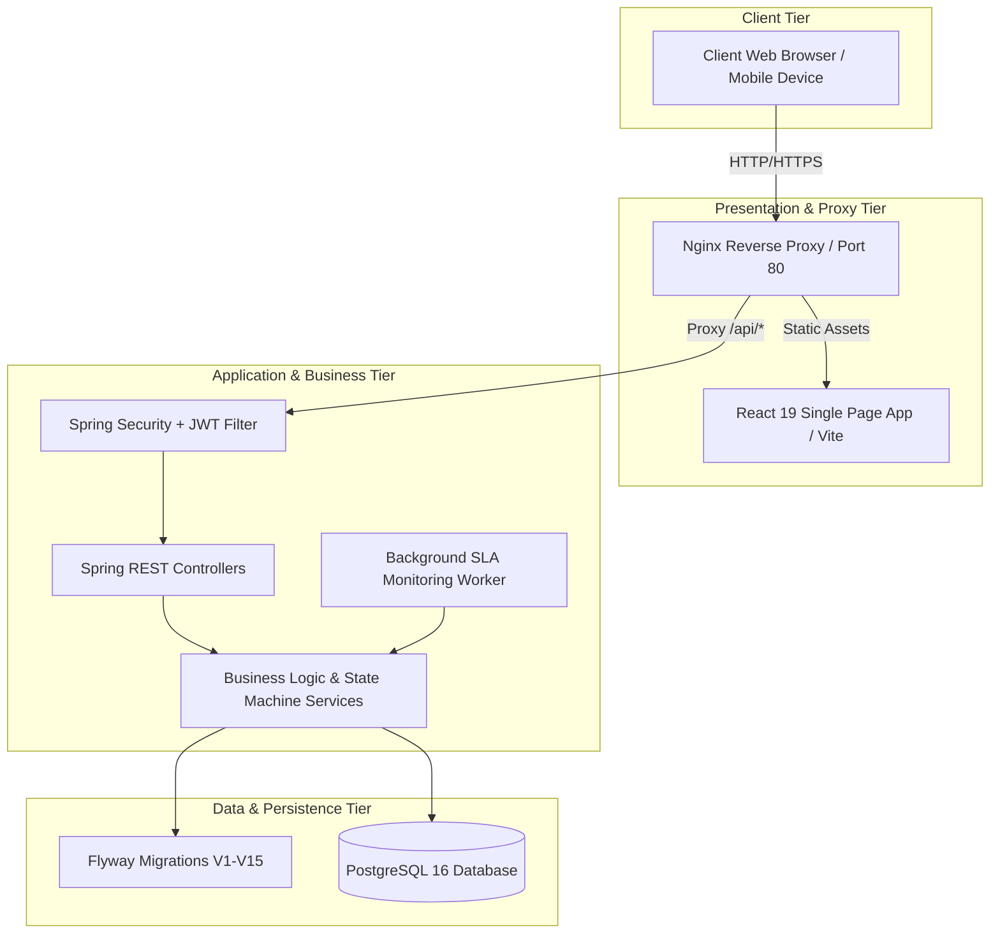
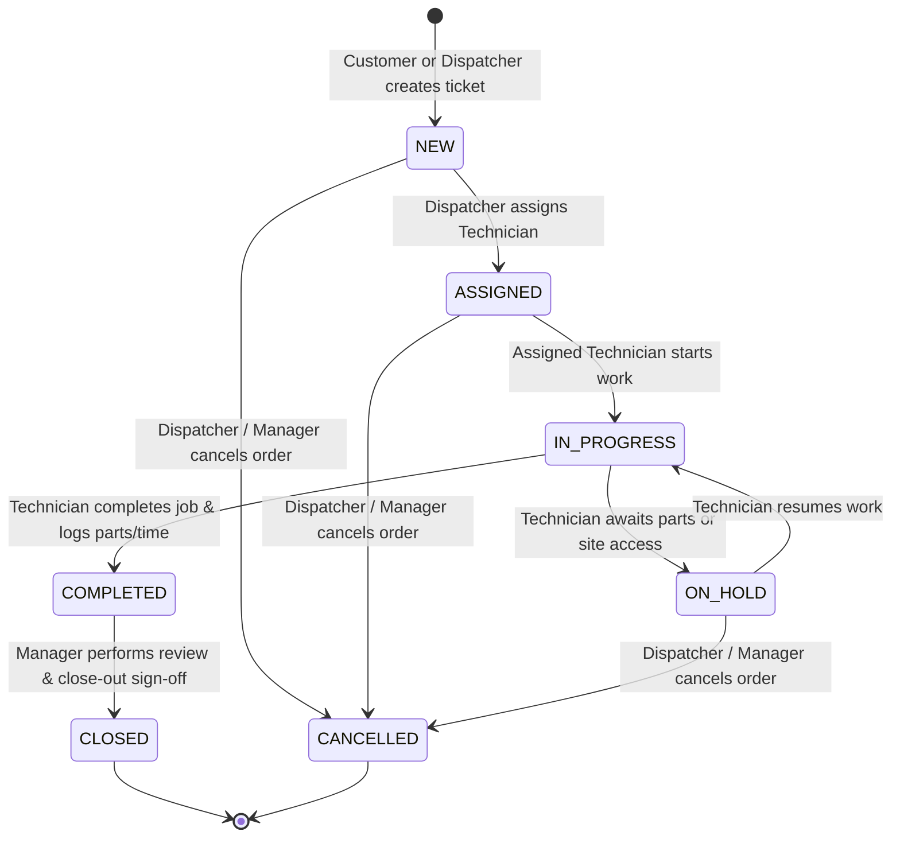
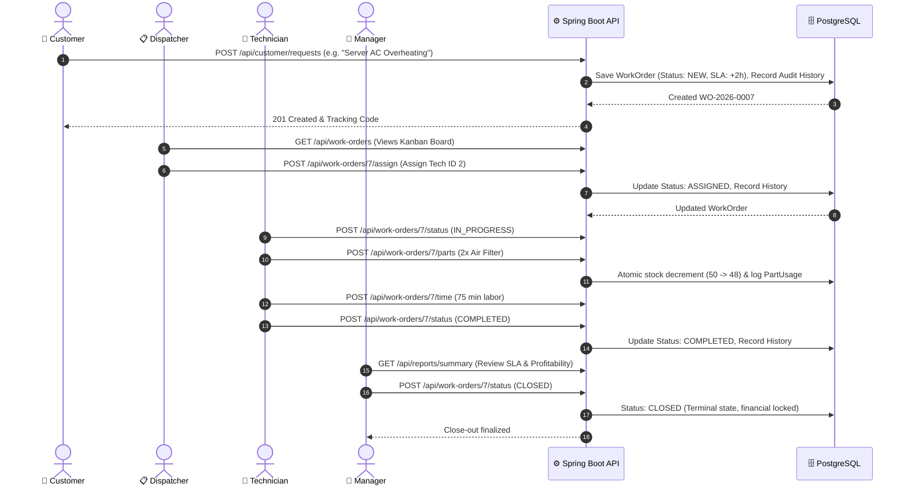
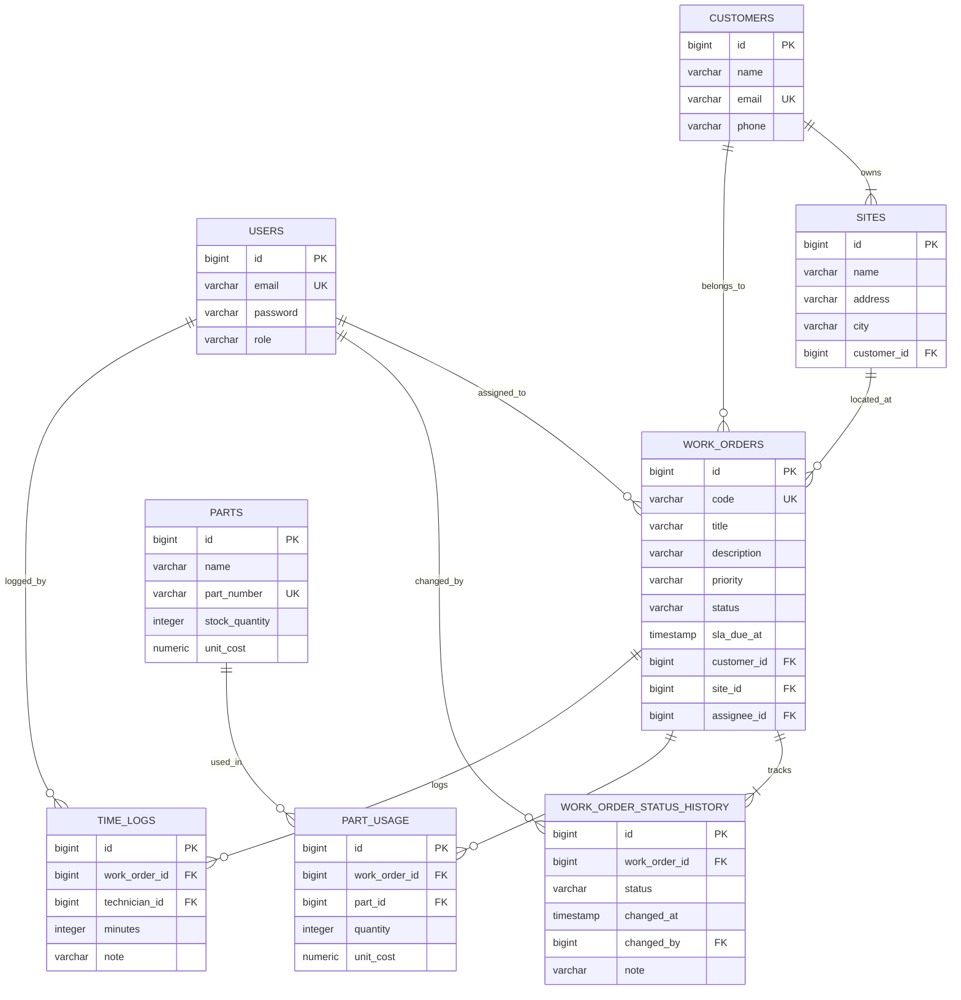

# 🏢 PROJECT KEYSTONE — COMPREHENSIVE ENGINEERING PROJECT REPORT

---

# 1. Title Page

```
========================================================================================
                                   PROJECT REPORT
                                         ON
                                  PROJECT KEYSTONE
            Enterprise Field Service & Work Order Management Platform

                      Built for: Meridian Facilities Management
                        Academic/Capstone Engineering Project
========================================================================================

Author / Lead Engineer : Surajit
Project Name           : KEYSTONE — Field Service Management (FSM) Platform
Technologies Used      : Spring Boot 3 (Java 21), React 19, PostgreSQL 16, Vite, 
                         Docker, Flyway, JWT, Tailwind CSS / Vanilla Design Tokens
Repository             : https://github.com/surajit654/Keystone
Date of Submission     : September 2026
========================================================================================
```

---

# 2. Abstract

Field Service Management (FSM) is a vital business capability for modern facility management and maintenance companies. Traditional service organizations rely on fragmented workflows, phone calls, paper work orders, and manual spreadsheets. This results in SLA breaches, lost billing hours, untracked parts inventory, lack of visibility into field technician workloads, and poor customer satisfaction.

**Project KEYSTONE** is a high-throughput, enterprise-grade, full-stack Field Service and Work Order Management platform engineered for **Meridian Facilities Management**. The platform establishes a **strictly governed 7-stage state machine** for work orders, automated priority-based **SLA monitoring with background breach detection**, transactional **inventory decrementing and technician labor time tracking**, **Role-Based Access Control (RBAC)** across 4 organizational personas (Customer, Dispatcher, Technician, Manager), an interactive **7-column Kanban board**, an **Executive KPI Analytics Dashboard**, and a **Customer Self-Service Portal**.

Built with **Spring Boot 3 (Java 21)**, **PostgreSQL 16**, and **React 19 (Vite)**, the system features stateless **JWT security**, 15 automated **Flyway database migrations**, comprehensive **unit and integration testing**, and full containerization via **Docker** and **Docker Compose** for instant production deployment.

---

# 3. Introduction

### 3.1 Problem Statement
Facility management organizations manage hundreds of critical commercial assets (HVAC systems, emergency generators, electrical substations, security access gates, plumbing grids) across distributed corporate sites. Meridian Facilities Management faced significant operational hurdles:
1. **Unstructured Communication & Delays**: Customers reported equipment breakdowns via ad-hoc emails or phone calls with no SLA tracking or automated ticket progression.
2. **Untracked Financials & Inventory**: Field technicians consumed expensive replacement parts without real-time inventory deduction, resulting in negative stock, phantom inventory, and untracked labor costs.
3. **Lack of Workflow Governance**: Without a state machine, work orders were prematurely closed, bypass transitions occurred, and audit trails of who approved transitions were nonexistent.
4. **Zero Executive Visibility**: Managers lacked real-time visibility into overall SLA compliance rates, technician utilization, and facility-specific workload distributions.

### 3.2 Motivation
The motivation behind Project KEYSTONE was to engineer an end-to-end digital nervous system that automates the entire lifecycle of a service request from the moment a customer raises an issue, through dispatcher triage and scheduling, technician field execution, real-time parts consumption, and managerial sign-off and reporting.

### 3.3 Objectives
- **Strict State Governance**: Enforce an automated finite state machine (`NEW` ➔ `ASSIGNED` ➔ `IN_PROGRESS` ➔ `ON_HOLD` ➔ `COMPLETED` ➔ `CLOSED` / `CANCELLED`) with append-only audit logging.
- **Automated SLA Engine**: Dynamically assign SLA deadlines by ticket priority (Critical: 2h, High: 4h, Medium: 8h/24h, Low: 48h) and run background workers to detect breach events.
- **Inventory & Labor Integrity**: Provide atomic transactional deductions for parts and log labor hours for real-time gross margin and job costing calculations.
- **Role-Based Workspaces**: Deliver tailored user experiences for 4 distinct personas (Manager, Dispatcher, Technician, Customer).
- **Production Readiness**: Build a cloud-native architecture using containerized micro-services with OpenAPI 3.0 (Swagger UI) documentation.

---

# 4. Project Overview

Project KEYSTONE connects all stakeholders in a unified real-time workflow:
- **Customers** submit service requests via a clean, self-service portal, receiving live status updates and SLA countdown timers.
- **Dispatchers** prioritize incoming tickets, inspect available field technicians, and assign jobs through an interactive 7-column Kanban board or paginated multi-criteria search table.
- **Technicians** manage assigned jobs on a mobile-ready field interface, starting work, putting jobs on hold, atomically consuming warehouse parts, logging labor time, and submitting completed work.
- **Managers** monitor executive KPIs (active work orders, overall SLA compliance %, parts and labor costs, technician utilization) and execute final close-out sign-offs.

---

# 5. Technology Stack

| Layer | Technology | Version | Purpose |
| :--- | :--- | :--- | :--- |
| **Backend Framework** | Spring Boot | 3.4+ | Core REST API, Security, Business Services, Dependency Injection |
| **Language (Backend)** | Java (JDK) | 21 (LTS) | Modern Java features (Records, Pattern Matching, Virtual Threads) |
| **ORM / Data Access** | Spring Data JPA / Hibernate | 6.x | Relational mapping, JPA Specifications, and Repository abstractions |
| **Database** | PostgreSQL | 16.x | ACID relational database with indexed foreign keys & constraints |
| **Database Migration**| Flyway | V1–V15 | Version-controlled database schema migrations and seed scripts |
| **Security & Auth** | Spring Security + JJWT | 0.12.6 | Stateless JWT authentication, BCrypt password hashing, RBAC claims |
| **API Documentation** | Springdoc OpenAPI / Swagger | 3.0 | Auto-generated interactive API documentation at `/swagger-ui.html` |
| **Frontend SPA** | React | 19.x | Component-driven Single Page Application |
| **Build Tool (Frontend)** | Vite | 8.x | High-speed frontend bundling, HMR, and build optimization |
| **Routing** | React Router DOM | 7.x | Declarative client-side routing and protected routes |
| **Styling** | Vanilla Design Tokens / CSS | CSS3 | Dark-mode ready, glassmorphic UI, responsive layouts |
| **Containerization** | Docker & Docker Compose | Multi-Stage | Production containers (Nginx for React, Temurin JRE 21 for Spring Boot) |
| **Cloud Hosting** | Railway / Supabase | Cloud | Cloud deployment platform with auto CI/CD builds |

---

# 6. System Requirements

### 6.1 Hardware Requirements
- **Processor**: Dual-core 2.0 GHz or higher (Quad-core Intel Core i5 / AMD Ryzen 5 recommended)
- **RAM**: Minimum 4 GB (8 GB or 16 GB recommended for running Docker and local JVM)
- **Storage**: Minimum 2 GB free disk space
- **Network**: Broadband Internet connection for cloud dependencies and API access

### 6.2 Software & Development Prerequisites
- **Operating System**: Windows 10/11, macOS 12+, or Ubuntu Linux 20.04+
- **Java Development Kit**: JDK 21 (Oracle JDK / Eclipse Temurin)
- **Node.js Environment**: Node.js v20+ and npm v10+
- **Database Engine**: PostgreSQL 16+ (or Docker Engine)
- **Containerization Engine**: Docker Desktop 4.x+ / Docker Compose v2+
- **Web Browser**: Modern browser (Google Chrome, Firefox, Edge, Safari)

---

# 7. System Architecture

Project KEYSTONE uses a decoupled 3-tier client-server architecture with an Nginx reverse proxy serving static React assets and forwarding API requests to the Spring Boot REST backend.



---

# 8. Application Workflow

### 8.1 Governed Work Order State Machine



### 8.2 End-to-End Operational Lifecycle Swimlane



---

# 9. Database Design

### 9.1 Entity Relationship (ER) Diagram



---

# 10. API & Backend Architecture

The backend adheres to a **Layered Service-Oriented Architecture (Controller-Service-Repository-Model)** with centralized exception handling and security interceptors:

```
src/main/java/com/KEYSTONE/
├── config/             # SecurityConfig, CorsConfig, OpenApiConfig, GlobalExceptionHandler
├── controller/         # AuthController, WorkOrderController, CustomerApiController, etc.
├── dto/                # Request & Response DTOs with Jakarta Validation
├── model/              # JPA Entities (WorkOrder, User, Customer, Site, Part, etc.)
├── repository/         # Spring Data JPA Repositories & Specifications
├── security/           # JwtService, JwtAuthenticationFilter
└── service/            # WorkOrderService, AuthService, ReportingService, SlaMonitoringService
```

### Key API Endpoints Summary

| Method | Endpoint | Allowed Roles | Description |
| :--- | :--- | :--- | :--- |
| `POST` | `/api/auth/login` | Public | Authenticates credentials and issues stateless signed JWT |
| `GET` | `/api/work-orders` | All Authenticated | Paginated multi-criteria search & filtering of work orders |
| `POST` | `/api/work-orders` | Dispatcher, Manager, Customer | Creates a new work order with SLA due time calculation |
| `GET` | `/api/work-orders/{id}` | All Authenticated | Retrieves full work order details including history, parts & time |
| `POST` | `/api/work-orders/{id}/assign` | Dispatcher, Manager | Assigns a technician and transitions order to `ASSIGNED` |
| `POST` | `/api/work-orders/{id}/status` | Technician, Manager | Transitions order status according to governed state machine |
| `POST` | `/api/work-orders/{id}/parts` | Technician, Dispatcher | Atomically decrements parts stock and logs parts used |
| `POST` | `/api/work-orders/{id}/time` | Technician | Logs technician labor minutes and work notes |
| `GET` | `/api/reports/summary` | Dispatcher, Manager | Executive dashboard metrics, SLA compliance %, workload stats |
| `POST` | `/api/customer/requests` | Customer | Customer self-service ticket submission |
| `GET` | `/api/customer/requests` | Customer | Real-time live status tracking for customer's own tickets |

---

# 11. Frontend Architecture

The frontend is built using **React 19** and **Vite 8** with a modular component hierarchy and global authentication context.

```
frontend/src/
├── api/                # apiClient.js (Fetch wrapper with Bearer token & error normalization)
├── components/         # Sidebar, StatCards, Navbar, Modals
├── context/            # AuthContext.jsx (JWT parsing, session persistence, logout)
├── pages/              # Login, DashboardPage, WorkOrders (Kanban), Technicians, Customers, CustomerPortal
├── App.jsx             # Protected route hierarchy and layout routing
├── index.css           # Vanilla design system (Dark mode, glassmorphism, badges, animations)
└── main.jsx            # React root mount
```

---

# 12. Major Features

1. **Governed 7-Stage State Machine**: Enforces strict operational transitions (`NEW` ➔ `ASSIGNED` ➔ `IN_PROGRESS` ➔ `ON_HOLD` ➔ `COMPLETED` ➔ `CLOSED`). Bypassing stages is blocked with HTTP `409 Conflict`.
2. **Interactive 7-Column Kanban Board**: Real-time visual cards displaying work order codes, priority badges, SLA countdowns, and quick detail modal drawers.
3. **Automated Priority SLA Engine**: Background scheduled worker checks SLAs every 60s, triggering visual alerts (`ON_TRACK`, `DUE_SOON`, `BREACHED`).
4. **Transactional Inventory Tracking**: Atomic database decrements guarantee stock cannot go negative.
5. **Customer Self-Service Portal**: Customers submit tickets and watch live visual progress bars move from `Submitted` to `Completed`.
6. **Executive KPI Dashboard**: Live analytics showing total orders, SLA compliance rate (%), status distribution, parts/labor cost rollup, and site workload breakdown.

---

# 13. Implementation

### 13.1 Authentication & Security
- **Stateless JWT**: JJWT 0.12.6 generates cryptographic tokens containing user email and `role` claim.
- **BCrypt Password Hashing**: Passwords stored as one-way salted hashes in PostgreSQL.
- **Filter Chain**: `JwtAuthenticationFilter` intercepts requests, extracts the Bearer token, validates signature/expiration, and populates the `SecurityContextHolder`.

### 13.2 Role-Based Functionality (4 Personas)

| Role | Seed Email | Permissions & Accessible Views |
| :--- | :--- | :--- |
| **Manager** | `manager@keystone.com` | Executive KPI dashboard, SLA compliance reports, final close-out signoff, customer & site management. |
| **Dispatcher** | `dispatcher@keystone.com` | Work order intake, 7-column Kanban board, technician assignment, customer & site management, cancellation. |
| **Technician** | `technician@keystone.com` | Field workbench view, start/hold/complete work orders, transactional parts consumption, labor time logging. |
| **Customer** | `customer@keystone.com` | Customer Self-Service Portal (`/portal`), urgent maintenance ticket creation, real-time status tracker. |

---

# 14. Screenshots & UI Layouts

### 14.1 Login Workspace
```
+-------------------------------------------------------------+
|                          [ K ]                              |
|                     Project KEYSTONE                        |
|           Meridian Facilities Management Platform           |
|                                                             |
|  Work Email: [ dispatcher@keystone.com                    ] |
|  Password  : [ ••••••••                                   ] |
|                                                             |
|             [    Sign In to Workspace    ]                  |
|                                                             |
|  QUICK DEMO LOGINS:                                         |
|  [Dispatcher: DISPATCH] [Technician: TECH] [Manager: ADMIN] |
+-------------------------------------------------------------+
```

### 14.2 Dispatcher Kanban Board
```
+----------------------------------------------------------------------------------------------------+
|  🔍 Search: [ filter orders... ]   | Status: [ All ] | Priority: [ All ] | [📊 Board] [📄 List]   |
+----------------------------------------------------------------------------------------------------+
|   NEW (2)   |  ASSIGNED (1) | IN PROGRESS (1)|   ON HOLD (1) | COMPLETED (1) |   CLOSED (1)    |
|-------------+---------------+----------------+---------------+---------------+-----------------|
| WO-2026-0002| WO-2026-0003  | WO-2026-0001   | WO-2026-0004  | WO-2026-0005  | WO-2026-0006    |
| Door Sensor | Chilled Valve | AC Overheating | Generator Flt | Lighting DALI | Solar Array PM  |
| 🔴 HIGH     | 🟡 MEDIUM     | 🔴 HIGH        | 🔴 HIGH       | 🟡 MEDIUM     | 🟢 LOW          |
| 🏢 Meridian | 🏢 Meridian   | 🏢 Meridian    | 🏢 Apex Hub   | 🏢 Meridian   | 🏢 Omni Med     |
| ⏱️ Due in 3h | ⏱️ Due in 18h | ⏳ Due in 1h   | ⏳ Due in 4h  | ✓ Done        | 🔒 Closed       |
+----------------------------------------------------------------------------------------------------+
```

### 14.3 Customer Self-Service Portal
```
+----------------------------------------------------------------------------------------------------+
| [K] KEYSTONE Customer Portal       Meridian Facilities Self-Service   Logged in: customer@keystone |
+----------------------------------------------------------------------------------------------------+
|  My Service Requests                                                 [ ➕ Raise New Request ]      |
|                                                                                                    |
|  +-----------------------------------------------------------------------------------------------+ |
|  | [WO-2026-0007] [HIGH PRIORITY]                                                                | |
|  | Main Server Room AC Unit Overheating                                                          | |
|  | Server room temperature is climbing past 85F. Immediate technician required.                 | |
|  |                                                                                               | |
|  | (✓) Submitted  =======>  (✓) Assigned  =======>  (3) In Progress  =======>  (4) Completed    | |
|  +-----------------------------------------------------------------------------------------------+ |
+----------------------------------------------------------------------------------------------------+
```

---

# 15. Testing

The platform includes automated testing across unit, domain, and integration levels:

```bash
cd KEYSTONE
./mvnw test
```

### Test Suite Summary:
- **`KeystoneApplicationTests`**: Validates Spring ApplicationContext bootstrap, Flyway schema validation, and Hibernate entity mappings.
- **`WorkOrderLifecycleTest`**: Comprehensive state machine validation verifying valid lifecycle (`NEW` ➔ `ASSIGNED` ➔ `IN_PROGRESS` ➔ `COMPLETED` ➔ `CLOSED`), rejection of invalid transitions (`409 Conflict`), rejection of unauthorized closures, and cancellation rules.
- **`InventoryTransactionTest`**: Tests transactional stock deduction, rejection of requests exceeding available stock, and invariant preservation.
- **`ReportingServiceTest`**: Validates Executive KPI calculation, SLA compliance aggregation %, and technician/site workload rollups.
- **`SecurityRbacTests`**: Validates stateless JWT token generation, cryptographic claim signature parsing, and rejection of malformed tokens.

---

# 16. Deployment

### 16.1 Docker Compose Deployment (Recommended)
The application is fully containerized using multi-stage Docker builds.

```bash
git clone https://github.com/surajit654/Keystone.git
cd Keystone
docker-compose up --build
```
- **Frontend Web App**: `http://localhost:3000`
- **Backend API**: `http://localhost:8080`
- **Interactive Swagger Docs**: `http://localhost:8080/swagger-ui.html`
- **PostgreSQL Database**: `localhost:5432`

### 16.2 Cloud Deployment (Railway / Supabase)
- **Backend**: Deployed on Railway with **Root Directory** = `/KEYSTONE` connected to Railway PostgreSQL.
- **Frontend**: Deployed on Railway/Vercel with **Root Directory** = `/frontend` and environment variable `VITE_API_URL` pointing to backend API.

---

# 17. Challenges & Solutions

| # | Technical Challenge | Solution Applied |
| :- | :--- | :--- |
| 1 | **Preventing Invalid State Bypasses** | Implemented strict guarded state transitions in `WorkOrderService` returning HTTP `409 Conflict` on illegal state jumps. |
| 2 | **Preventing Inventory Race Conditions & Negative Stock** | Enforced `@Transactional` boundary on part consumption with pre-check invariants and atomic stock decrementing. |
| 3 | **Real-Time Customer-to-Kanban Sync** | Unified Customer Portal requests with the `WorkOrder` entity, automatically generating `WO-YYYY-XXXX` codes and updating status in real-time. |
| 4 | **Cross-Origin Cloud Deployment (CORS)** | Configured `WebMvcConfigurer` with `allowedOriginPatterns("*")` and dynamic `VITE_API_URL` environment variable support. |

---

# 18. Learning Outcomes

- Mastery of **Spring Boot 3** and **Java 21 LTS** enterprise patterns (JPA Specifications, DTO validation, transaction management).
- Deep understanding of **Stateless Security** and **Role-Based Access Control (RBAC)** using JWT and Spring Security filters.
- Experience with **Flyway database versioning** and strict relational database modeling in **PostgreSQL 16**.
- Full-stack state coordination using **React 19**, **Vite**, and responsive modern CSS design systems.
- Production-grade **Docker multi-stage builds**, Nginx reverse proxies, and cloud CI/CD deployments.

---

# 19. Future Scope

1. **Real-Time WebSockets / SSE**: Push instant Kanban card updates across dispatchers and technicians without manual browser polling.
2. **GPS Geolocation & Routing**: Integrate Google Maps / OpenStreetMap to route technicians to sites based on real-time traffic.
3. **Mobile Native App (React Native / PWA)**: Provide offline-first capabilities for field technicians in low-signal basement areas.
4. **Predictive Maintenance with AI**: Use machine learning models to forecast HVAC and generator failures based on historical maintenance logs.

---

# 20. Conclusion

Project KEYSTONE delivers a high-throughput, enterprise-grade Field Service and Work Order Management platform for Meridian Facilities Management. By combining strict state machine governance, automated SLA monitoring, transactional inventory tracking, 4-role RBAC security, and an intuitive user interface, the system eliminates paper work orders, streamlines dispatch operations, protects inventory margins, and empowers executive decision-making.

---

# 21. GitHub & Live Demo Links

- **GitHub Repository**: [https://github.com/surajit654/Keystone](https://github.com/surajit654/Keystone)
- **Interactive OpenAPI Documentation**: `http://localhost:8080/swagger-ui.html`
- **Docker Compose Setup**: `docker-compose up --build`
- **Seed Demo Accounts**: `manager@keystone.com` · `dispatcher@keystone.com` · `technician@keystone.com` · `customer@keystone.com` (Password: `password`)
