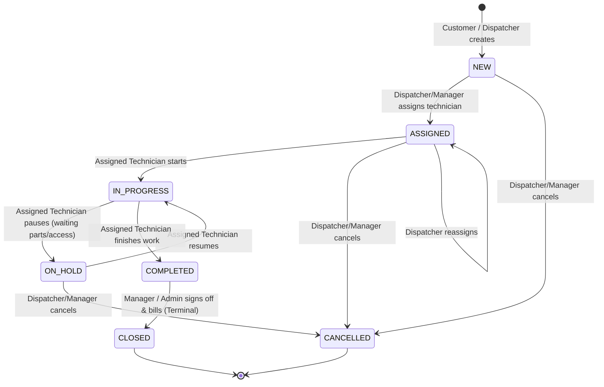

# 📕 Week 3: Workflow & Rules Plan (Days 11–15)

**Milestone:** M3 — Workflow & Rules  
**Score Weight:** 20 Project Points *(Highest weighted milestone — 40% of project marks!)*  
**Goal:** Governed work-order state machine, guarded transitions with audit history, technician field view, transactional parts/time tracking, and automated SLA breach engine.

---

## 🗺️ Work-Order State Machine Architecture

---

## 📅 Granular Step-by-Step Execution Breakdown

### 🔹 Step 1: Governed State Machine & Audit History (Days 11–12)

#### 1.1 Status Transition Guard Rules
- [x] Implement transition validator in `WorkOrderService` enforcing strict role & state matrices:
  - `NEW` → `ASSIGNED` (`DISPATCHER`, `MANAGER`)
  - `ASSIGNED` → `IN_PROGRESS` (Only assigned `TECHNICIAN`)
  - `IN_PROGRESS` → `ON_HOLD` (Only assigned `TECHNICIAN`)
  - `ON_HOLD` → `IN_PROGRESS` (Only assigned `TECHNICIAN`)
  - `IN_PROGRESS` → `COMPLETED` (Only assigned `TECHNICIAN`)
  - `COMPLETED` → `CLOSED` (Only `MANAGER` / `ADMIN`)
  - `NEW` / `ASSIGNED` / `ON_HOLD` → `CANCELLED` (`DISPATCHER`, `MANAGER`)
- [x] Reject any invalid status jump with HTTP `409 Conflict` (or `400 Bad Request`) and descriptive error message.
- [x] Prevent any updates to terminal states (`CLOSED`, `CANCELLED`).

#### 1.2 Append-Only Audit Trail
- [x] Create `WorkOrderStatusHistoryRepository` (`findByWorkOrderIdOrderByChangedAtAsc`).
- [x] On every valid status transition, automatically insert an immutable row into `work_order_status_history` (`work_order_id`, `status`, `changed_by`, `changed_at`, `note`).
- [x] Create endpoint `GET /api/work-orders/{id}/history` to retrieve full audit history timeline.

---

### 🔹 Step 2: Dispatch & Technician Field Execution (Day 13)

#### 2.1 Dispatcher Assignment API
- [x] Create endpoint `POST /api/work-orders/{id}/assign` (`@RequestBody AssignTechnicianRequest`):
  - Validates work order exists and is not `CLOSED`/`CANCELLED`.
  - Validates technician exists and has `Role.TECHNICIAN`.
  - Sets assignee, transitions status to `ASSIGNED`, and writes audit record.
  - Supports reassignment while the job is still open.

#### 2.2 Technician Field Workflow Endpoints
- [x] Create endpoint `GET /api/technician/work-orders` (returns only jobs assigned to the authenticated technician).
- [x] Create endpoint `POST /api/work-orders/{id}/status` (`@RequestBody TransitionStatusRequest` with transition notes):
  - Validates that the logged-in technician is the assigned technician on that ticket.

#### 2.3 Frontend Mobile-Optimized Field View
- [x] Enhance `Technicians.jsx` and `WorkOrders.jsx` with card UI:
  - Big action buttons: **"Start Work"**, **"Put On Hold"**, **"Resume Work"**, **"Complete Work"**.
  - Form to input status change notes.
  - Timeline view displaying previous status history.

---

### 🔹 Step 3: Transactional Parts Usage & Time Logging (Day 14)

#### 3.1 Repositories & DTOs
- [x] Create `PartRepository` (`JpaRepository<Part, Long>`).
- [x] Create `PartUsageRepository` (`findByWorkOrderId`).
- [x] Create `TimeLogRepository` (`findByWorkOrderId`).
- [x] Create DTOs:
  - `LogPartUsageRequest` (`partId`, `quantityUsed`), `PartUsageResponse`
  - `LogTimeRequest` (`minutes`, `note`), `TimeLogResponse`
  - `PartResponse` (`id`, `name`, `partNumber`, `stockQuantity`, `unitCost`)

#### 3.2 Inventory & Stock Integrity Logic (`@Transactional`)
- [x] Implement `POST /api/work-orders/{id}/parts`:
  - Verify work order is active (`IN_PROGRESS` or `ASSIGNED`).
  - Check `parts.stock_quantity >= quantityUsed`.
  - **Invariant Rule: Stock cannot go negative**. If stock is insufficient, throws exception and triggers automatic `@Transactional` rollback.
  - Decrement stock atomically: `part.setStockQuantity(part.getStockQuantity() - quantityUsed)`.
  - Record `PartUsage` entry.
- [x] Implement `GET /api/parts` (List inventory parts for technician selection).

#### 3.3 Technician Time Logging
- [x] Implement `POST /api/work-orders/{id}/time`:
  - Verify work order is open.
  - Save `TimeLog` with `minutes`, `note`, `technician`, `workOrder`.

#### 3.4 Work Order Financial & Labor Rollup
- [x] Aggregate on `WorkOrderResponse`:
  - `totalPartsCost` (`SUM(partUsage.quantityUsed * part.unitCost)`).
  - `totalLaborMinutes` (`SUM(timeLog.minutes)`).
  - List of parts consumed and time logs on work order detail modal.

---

### 🔹 Step 4: SLA Engine & Automated Scheduled Breach Detection (Day 15)

#### 4.1 Priority-Based SLA Due Calculation
- [x] Dynamic SLA duration mapping on creation:
  - `HIGH`: 4 hours
  - `MEDIUM`: 24 hours
  - `LOW`: 48 hours
- [x] Preserve SLA baseline across technician reassignment.

#### 4.2 Spring `@Scheduled` Background Breach Worker
- [x] Enable `@EnableScheduling` in `KeystoneApplication.java`.
- [x] Create `SlaMonitoringService`:
  - Runs periodically every 60 seconds.
  - Queries open work orders (`status NOT IN ('COMPLETED', 'CLOSED', 'CANCELLED')`).
  - Logs `[SLA AT RISK]` warnings if due in `< 1 hour`.
  - Logs `[SLA BREACH ALERT]` warnings if `slaDueAt < LocalDateTime.now()`.

#### 4.3 UI SLA Dashboard & Badge Integration
- [x] Color-coded SLA indicators on Kanban cards & table rows:
  - 🟢 `ON_TRACK` (> 2 hours remaining)
  - 🟡 `AT_RISK` (<= 1 hour remaining)
  - 🔴 `BREACHED` (deadline passed)
- [x] SLA countdown timer display on Work Order detail drawer.

---

### 🔹 Step 5: Milestone M3 Review & Verification (End of Week 3)
- [x] Backend compilation test (`./mvnw test-compile` -> 64 source files compiled, BUILD SUCCESS).
- [x] Frontend build verification (`npm run build` -> production bundle built in 185ms).
- [x] Updated `KEYSTONE_MASTER_CHECKLIST.md` with **Milestone M3 (20/20 pts)**.
